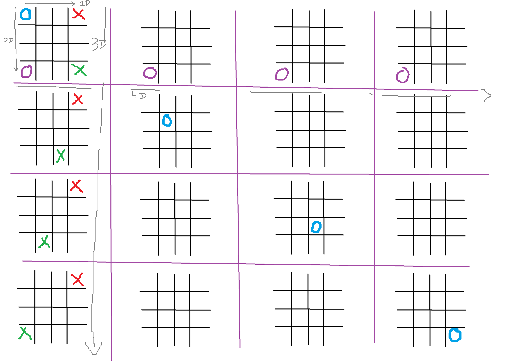
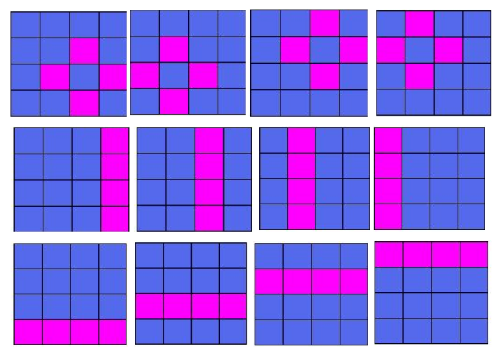
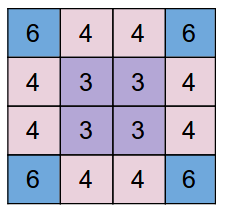

# Extreme Tic Tac Toe Bot
This bot plays the 4x4x4x4 variant of TicTacToe. It comprises f a 4x4 board in which each cell further is a 4x4 board. The whole board is called BigBoard and each inner board is called SmallBoard. Hence, each cell of BigBoard is a SmallBoard and SmallBoard
itself has 16 cells.  



## How to Play
#### Python Libraries required:
- copy
- datetime
- sys
- random
- signal
- time
- traceback

```
python simulator.py <option>
```
&lt;option> can be:  
1 => Random player vs. Random player  
2 => Human vs. Random Player  
3 => Human vs. Human  
4 => Bot vs. Human  
5 => Bot vs. Random_Player  
6 => Bot vs. Bot  

## Rules of the game
- **FIRST MOVE**: The first player takes the first move and it is a free move. The player is free to move anywhere i.e. in any cell of any
SmallBoard.  

- **CORRESPONDENCE RULE**: When a player places his marker in any of the cell, the next player can only place marker in a SmallBoard corresponding to that cell. For Example: If a player places his marker
in Top Right Corner cell of a SmallBoard then the next player can only place his marker in available cells of the Top Right Corner
SmallBoard.

- **ABANDON RULE**: Once a SmallBoard is won by some player, that SmallBoard is abandoned and it has to be considered full, i.e. no more markers can be placed in that SmallBoard.

- **OPEN MOVE**: In case all the cells of the destined SmallBoard from “Correspondence Rule” are occupied or if the the destined SmallBoard is abandoned according to “Abandon Rule”, then the move is considered to be an open move, i.e. the player can move anywhere, on any available cell of any SmallBoard, given that SmallBoard is not abandoned.  

- **BONUS MOVE**: If a player places his marker in a cell of a SmallBoard and this leads to the player winning that SmallBoard, then the he/she gets a bonus move, i.e., he/she gets to move again.
This bonus move is limited to 2 SmallBoard wins, i.e., If you win another SmallBoard by placing the marker again in your bonus move, you don’t get another bonus move.

- **WIN RULE**: The player who places their markers on 4 cells of a SmallBoard such that they form a vertical or horizontal line or 4 cells such that they form a diamond win that SmallBoard. Similarly, player who wins 4 SmallBoards such that they form a vertical or horizontal line or win 4 SmallBoards such that they form a diamond win the
whole game.


- **TIME LIMIT**: Each player needs to make a valid move within 16 seconds. If the time limit exceeds 16 seconds for a particular move, then the match will be forfeited and the opponent wins the whole match by default.

## Scoring
- Winning a game, by forming a pattern as described in WIN RULE will give you 68 points and the opponent 0 points
​
- If a player makes an invalid move, or exceeds time limit, then the opponent earns 68 points and
the player earns 0 points
​
- If no player has a pattern at the end of the game, both the player gets points according to the SmallBoards won. Each SmallBoard has different score as shown below. Smallboards which are
drawn do not count as points for either player.


